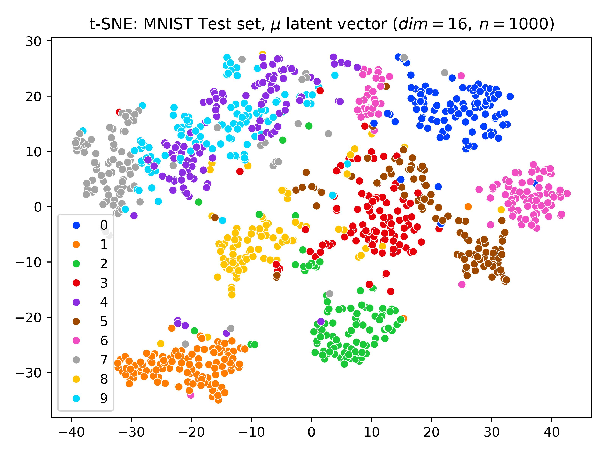

# VAE Implementation with PyTorch

## Description
* This is Variational Autoencoder(VAE) Implementation with PyTorch!

## Preview: CelebA
### (1) Reconstruction

<p align="center">
    
</p>

### (2) Generation

<p align="center">
    
    
    
    
</p>

## Preview: MNIST
### (1) Reconstruction
<p align="center">
    
</p>

### (2) Generation

<p align="center">
    
    
    
    
</p>

### (3) Latent Space t-SNE

<p align="center">
    
</p>

## Installation
```
# Docker (Optional)
docker pull ubuntu:22.04
docker run -itd --gpus=all --shm-size=16G --name=vae ubuntu:22.04 /bin/bash

apt-get update
apt-get install sudo
sudo apt-get install git
sudo apt-get install gdown # For CelebA Dataset
sudo apt-get install unzip
sudo apt-get install -y libgl1-mesa-glx # OpenCV
sudo apt-get install -y libglib2.0-0 # OpenCV

# Download
git clone https://github.com/drawcodeboy/VAE.git
cd VAE

# Download CelebA
gdown --id 1m8-EBPgi5MRubrm6iQjafK2QMHDBMSfJ --output data/
unzip data/celeba.zip -d data/
unzip data/celeba/img_align_celeba.zip -d data/celeba/

# Install Python
sudo apt-get install python3
sudo apt-get install python3-venv

# Virtual Environment
python3 venv -m .venv
source .venv/bin/activate

# Install packages
pip install -r requirements.txt

# train MNIST
python train.py --config=vae.mnist

# train CelebA
python train.py --config=vae.celeba

# test MNIST
python test.py --config=vae.mnist

# test CelebA
python test.py --config=vae.celeba
```

## References
1. <i><b>VAE</b></i>: <a href="https://arxiv.org/pdf/1312.6114">Kingma, D. P. (2013). Auto-encoding variational bayes. <i>arXiv preprint arXiv:1312.6114.</i></a>
